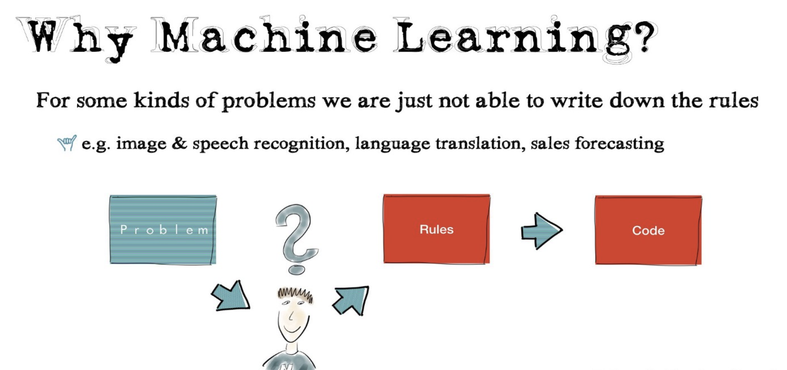
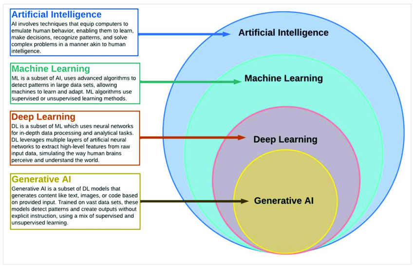

## Why ML?

## Introduction

    
#### Understanding AI, ML, DL, and GenAI
    Artificial Intelligence (AI), Machine Learning (ML), Deep Learning (DL), and Generative AI (GenAI) are buzzwords often used interchangeably, but they represent different concepts. Let's break them down in simple terms.
    
##### What is AI?
    Artificial Intelligence refers to the broader concept of machines being able to carry out tasks in a way that mimics human intelligence. 
    These tasks include understanding language, recognizing patterns, solving problems, and making decisions.
    
    Example: Self driving cars

##### What is ML?
    Machine Learning is a subset of AI. 
    It focuses on systems that can learn from data and improve their performance over time without explicit programming for every scenario. 
    ML algorithms find patterns in data and use these patterns to make predictions or decisions.
    
    Example: Email classification - Spam or Not Spam
    
##### What is DL?
    Deep Learning is a specialized subset of ML that uses neural networks with many layers (hence "deep"). 
    These networks mimic the human brain's structure and are capable of learning from large amounts of data.
    
    Example: Face recognition 
    
##### What is GenAI?
    Generative AI refers to models that create new content, like text, images, music, or code. 
    These models are trained on vast datasets and use patterns from this training to generate realistic and creative outputs.
    
    Example: ChatGPT generating conversational text.
    
##### Key Differences and Relationships
    AI is the big umbrella.
    ML is a part of AI, focusing on learning from data.
    DL is a part of ML, specialized in working with complex datasets and neural networks.
    GenAI leverages DL and ML to generate new, creative content.
