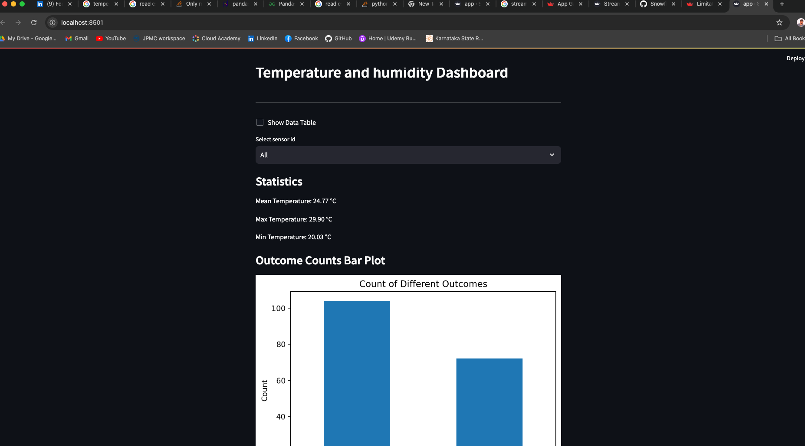

### ETL Process
#### Pre request
    Install docker :
    https://docs.docker.com/desktop/

#### Pakages to be install 
    pip install kafka-python
    pip install streamlit
#### Start Docker & kafka
    - Start docker desktop
    - docker run -p 9092:9092 apache/kafka:3.8.0

    - Start Producer
        python producer.py
    - Start Consumer
        python consumer.py
    - Start Visualization
        streamlit run app.py

#### Stream Lit App UI 

