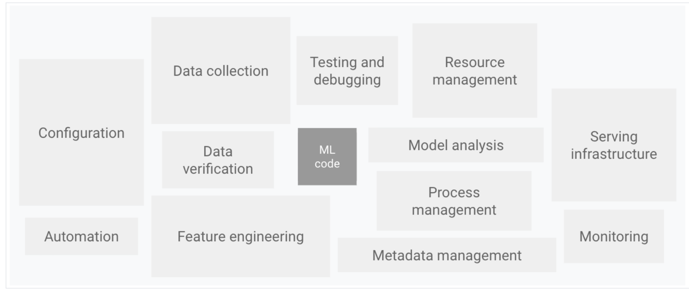
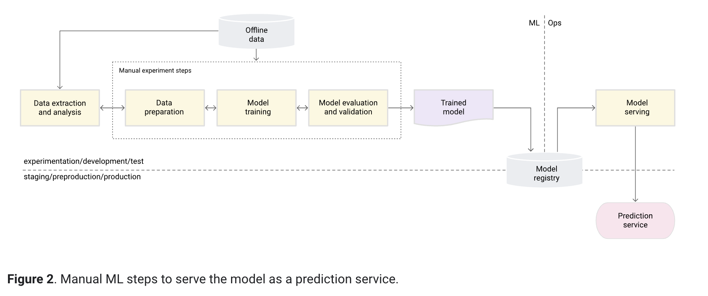
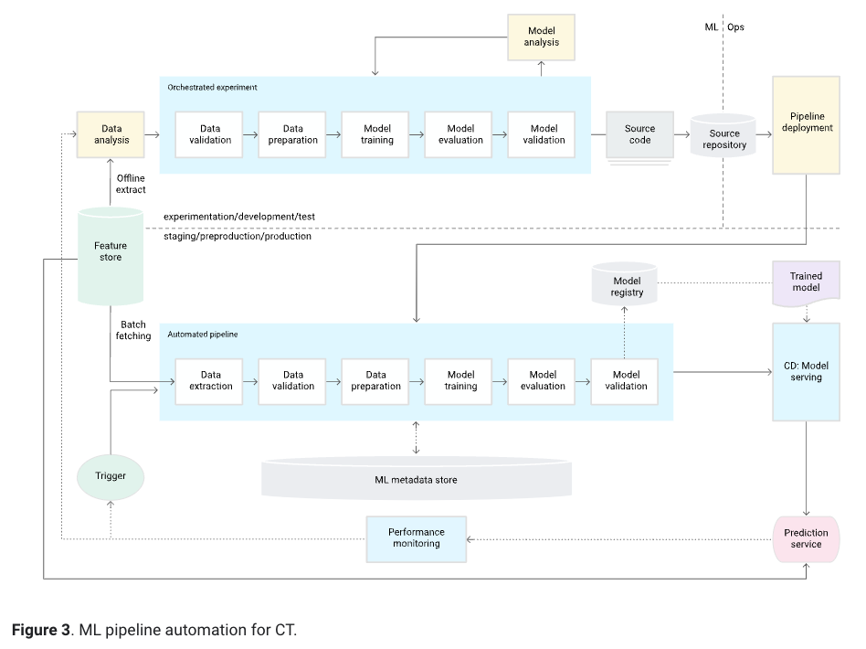
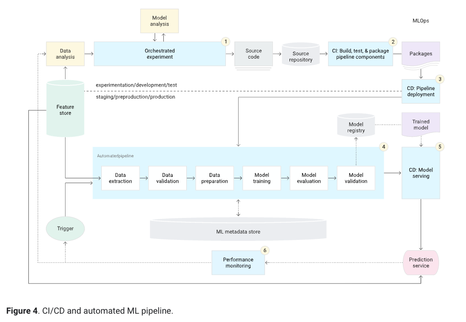
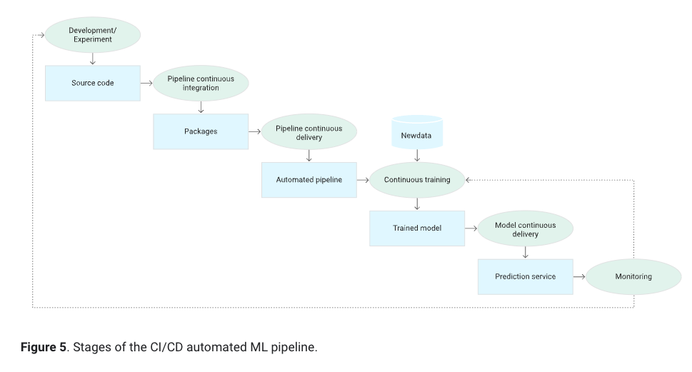

# Introduction
    Ref : https://cloud.google.com/architecture/mlops-continuous-delivery-and-automation-pipelines-in-machine-learning
    MLOps: Continuous delivery and automation pipelines in machine learning
    This document discusses techniques for implementing and automating continuous integration (CI), continuous delivery (CD), and continuous training (CT) for machine learning (ML) systems. 
    This document applies primarily to predictive AI systems.

    The preceding diagram displays the following system components:
    
    Configuration
    Automation
    Data collection
    Data verification
    Testing and debugging
    Resource management
    Model analysis
    Process and metadata management
    Serving infrastructure
    Monitoring

#### Data science steps for ML
    1. Data extraction: You select and integrate the relevant data from various data sources for the ML task.
    2. Data analysis: You perform exploratory data analysis (EDA) to understand the available data for building the ML model. This process leads to the following:
    Understanding the data schema and characteristics that are expected by the model.
    Identifying the data preparation and feature engineering that are needed for the model.
    3. Data preparation: The data is prepared for the ML task. This preparation involves data cleaning, where you split the data into training, validation, and test sets. You also apply data transformations and feature engineering to the model that solves the target task. The output of this step are the data splits in the prepared format.
    4. Model training: The data scientist implements different algorithms with the prepared data to train various ML models. In addition, you subject the implemented algorithms to hyperparameter tuning to get the best performing ML model. The output of this step is a trained model.
    5. Model evaluation: The model is evaluated on a holdout test set to evaluate the model quality. The output of this step is a set of metrics to assess the quality of the model.
    6. Model validation: The model is confirmed to be adequate for deployment—that its predictive performance is better than a certain baseline.
    7. Model serving: The validated model is deployed to a target environment to serve predictions. This deployment can be one of the following:
    Microservices with a REST API to serve online predictions.
    An embedded model to an edge or mobile device.
    Part of a batch prediction system.
    8. Model monitoring: The model predictive performance is monitored to potentially invoke a new iteration in the ML process.

#### MLOps level 0: Manual process

#### MLOps level 1: ML pipeline automation

#### MLOps level 2: CI/CD pipeline automation

    
    This MLOps setup includes the following components:
    
    Source control
    Test and build services
    Deployment services
    Model registry
    Feature store
    ML metadata store
    ML pipeline orchestrator
#### Charcteristics

